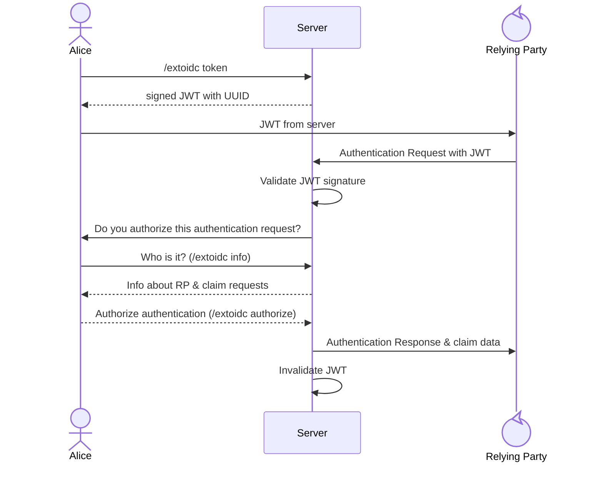

# extoidc

This is a work-in-progress specification.

This specification introduces the `draft/extoidc` CAP token for servers to indicate support for this specification.

Software implementing this work-in-progress specification MUST NOT use the unprefixed `extoidc` CAP name. Instead, implementations SHOULD use the `draft/extoidc` CAP name to be interoperable with other software implementing a compatible work-in-progress version. The final version of the specification will use unprefixed CAP names.

## Motivation

This specification allows for end-users to authenticate to external services securely over IRC transport without a web-browser requirement. It additionally forms the core of the draft/OBJECTSTORAGE` authentication system.

## Definitions

The key words "MUST", "MUST NOT", "REQUIRED", "SHALL", "SHALL NOT", "SHOULD", "SHOULD NOT", "RECOMMENDED",  "MAY", and "OPTIONAL" in this document are to be interpreted as described in RFC 2119.

“Server” refers to the IRC daemon

“Client” refers to the end-user software interacting with the server

“Relying Party” refers to the service requiring authentication from the client.

## Flow

The client SHALL utilize the `extoidc token` command to issue a single-use token for authentication.

The client SHALL present the token to the Relying Party to begin an authentication session.

The Relying Party MAY send an Authentication Request to the server to begin a CIBA session, and SHALL present the token as a `login_hint_token`.

Upon receipt of an Authentication Request, the server SHALL validate the signature and ID of the token. Once validated, the server SHALL notify the client of a pending authorization request with a `standard-reply` in the following format:

```
NOTE extoidc AUTHORIZE [UUID] :A new authorization request requires action.
```

The client SHOULD then utilize the `extoidc info` command to get the required information to present to the user for informed consent.

Once the end-user has either consented or rejected the authorization request, the client SHALL either use the `extoidc authorize` or `extoidc reject` commands corresponding to the user action.

### Diagram



## OpenID Connect

Servers SHALL implement a discoverable [OpenID Connect](https://openid.net/specs/openid-connect-core-1_0.html) provider with a published JSON Web Key Set that is used to sign tokens.

Servers SHALL implement the [OpenID Connect Client-Initiated Backchannel Authentication Flow](https://openid.net/specs/openid-client-initiated-backchannel-authentication-core-1_0.html#rfc.section.2) which SHOULD be the primary or exclusive flow.

Servers SHALL register Relying Parties and store metadata about the Relying Party to surface for informed consent. Servers MAY use the [OpenID Connect Dynamic Client Registration](https://openid.net/specs/openid-connect-registration-1_0.html#ClientMetadata) specification for this.

The out-of-band mechanism for authenticating a client SHALL be the `extoidc` command.

### Claims

*This section is non-normative*

This specification does not attempt to dictate what claims may be provided by the server and how client consent for claims is dictated. However, clients should make an active effort to determine informed consent for claims requested by the Relying Party.

## `extoidc` command

The `extoidc` command is used to authorize an external CIBA session and retrieve info about the Relying Party to surface for informed consent.

### `extoidc token`

Upon the receipt of this command, the server SHALL issue and return a signed (with the published JWKS) JSON Web Token with an associated UUID as the `jti`.

The server SHALL record the requesting client and token UUID.

The client SHALL record the token UUID until action on the authorization request is taken.

### `extoidc authorize [UUID]`

Upon receipt of this command, the server SHALL return a successful authorization and any claim data to the Relying Party in accordance with the negotiated CIBA mode. 

After the authorization and claims are consumed by the Relying Party, the server and client SHALL discard the token record.

### `extoidc reject [UUID]`

Upon receipt of this command, the server SHALL return a failed authorization to the Relying Party in accordance with the negotiated CIBA mode. 

After the failure is consumed by the Relying Party, the server and client SHALL discard the token record.

### `extoidc info [UUID]`

This subcommand fetches the info of the Relying Party as registered with the server, as well as the requested claim scopes and other information of the authentication request for a given session ID.

It should provide the information in a JSON string array containing the following items:

0. A relying party metadata object, as defined in [OpenID Connect Dynamic Client Registration § 2](https://openid.net/specs/openid-connect-registration-1_0.html#ClientMetadata)
1. The full [Authentication Request](https://openid.net/specs/openid-connect-core-1_0.html#AuthRequest) sent by the Relying Party, **with the exception of the login_hint_token, which contains the shared secret.**

### `extoidc config`

#### `extoidc config claims [LANG]`

This subcommand provides user-facing descriptions for OpenID Connect claims advertised by the server. Upon receipt of the command, the server SHALL return a dictionary of claims and their associated descriptions.
