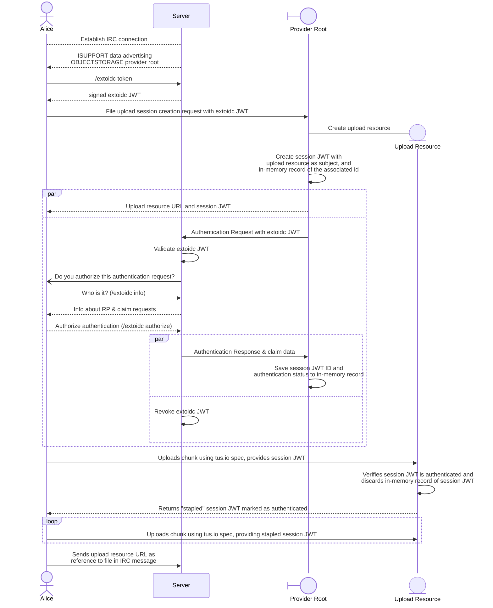

# objectstorage

This is a work-in-progress specification.

Software implementing this work-in-progress specification SHALL NOT use the unprefixed `OBJECTSTORAGE` ISUPPORT name. Instead, implementations SHOULD use the `draft/OBJECTSTORAGE` ISUPPORT name to be interoperable with other software implementing a compatible work-in-progress version. The final version of the
specification will use unprefixed ISUPPORT names.

## Motivation

This specification offers a way for servers to advertise an object storage provider for authenticated users to upload files (such as text or images), so they can post them on IRC.

## Definitions

“Server” refers to the IRC daemon

“Client” refers to the end-user software interacting with the server

“Provider” refers to the advertised (by the server) object storage provider

## Architecture

This specification introduces the `draft/OBJECTSTORAGE`  isupport token.

Its value SHALL be a URI and SHOULD use the `https` scheme. Clients SHALL ignore tokens with an URI scheme they don't support. Clients SHALL refuse to use unencrypted URI transports (such as plain `http`) if the IRC connection is encrypted (e.g. via TLS).

Providers SHALL support the [tus.io](https://tus.io/protocols/resumable-upload) resumable upload protocol and the creation extension.

When clients wish to upload a file using the server's advertised provider, they SHALL begin an `EXTOIDC` authentication session by requesting a token with `EXTOIDC token`. 

The client then SHALL send a tus.io creation `POST` request to the provider, while providing the `EXTOIDC` token in the `Authorization` header with the Bearer scheme. 

The provider SHALL immediately return an upload URL in the Location header and a signed JWT which shall expire in 1 hour in the `X-Session-Token` header, while beginning an `EXTOIDC` CIBA authentication in the background with the provided `EXTOIDC` token.

Once authentication is complete, clients SHALL then use the tus.io core protocol to upload or manage the file at the provider at the upload URL while providing either in the `Authorization` header with the Bearer scheme:

a) The `X-Session-Token` provided after either the creation or a previous request,

b) A `EXTOIDC` token to begin an authentication session with. The provider SHALL begin a CIBA authentication session and SHALL immediately return a `401 Unauthorized`  and a new `X-Session-Token` to indicate that the authorization session has not been completed.

Providers SHALL ensure the valid authentication status for an `X-Session-Token` and that usage of a valid `X-Session-Token` does not require a new CIBA authentication session. Providers SHALL include an `X-Session-Token` with each successful request after an `EXTOIDC` CIBA session. Clients SHALL replace any existing `X-Session-Token` with one provided in the `X-Session-Token` header in a given response.

> [!TIP]
> Providers may "staple" `X-Session-Token` tokens to avoid storing perpetually a list of authenticated token IDs, since any `X-Session-Token` provided on a subsequent request shall replace any previous token. This is demonstrated in the Diagram below.

Once the upload is completed, the upload URL is now usable to point to the file in IRC conversation and can be managed with either an unexpired `X-Session-Token` or by starting a new `EXTOIDC` session.

## Diagram

